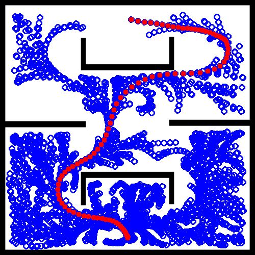
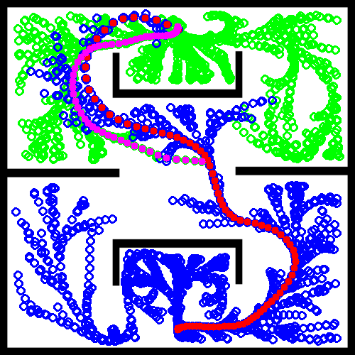

# BiRiskRRTValidation

### _*.py_ Files Explanation

* _riksrrt.py_
  * Implement unidirectional RiskRRT. 

* _biriksrrt.py_
  * Implement bidirectional RiskRRT (BiRiskRRT) and endow RiskRRT and BiRiskRRT with dynamic planning capability.

* _param.py_
  * setup hyper-parameters for the planners.

* _utils.py_
  * define the data structures and classes used in the planners.

* _main.py_
  * run the planners multiple times and record the statistic results into 'results' folder.

* _result_analysis.py_
  * compute and print the mean values and standard values of the trails conducted by _main.py_.
***************************
### Folders Introduction

* ___/data___
  * This folder stores the data of dynamic pedestrians from different datasets.

* ___/maps___
  * This folder contains the test maps (_.png_ format).

* ___results___
  * This folder stores the test results and also the visualizations of the planning processes.
  * ___/dynamic___ is for tests with dynamic obstacles (pedestrians).
  * ___/static___ is for tests without dynamic obstacles.
****************************
### Visualization Example in Dynamic Environment (without pedestrian trajectories)
  #### Unidirectional RiskRRT (_crowds_zara01_)
  
  #### Bidirectional RiskRRT (_crowds_zara01_, connect heuristic step = 3)
  

****************************

### Current Results (Dynamic '_crowds_zara01_')
| Items | Means | Standard Error|
| ----                         | ----      | ----  |
|Bidirectional Time            |  **50.17s** |  **26.67s** |
|Bidirectional Cost            |  48.43m |  5.35m|
|Bidirectional Navigation time |  36.00s |  4.41s|
|Unidirectional Time           |  62.79s |  56.25s |
|Unidirectional Cost           |  48.26m|  4.75m |
|Unidirectional Navigation Time|  35.98s |  3.52 |

### Current Results (Static)
| Items | Means | Standard Error|
| ----                         | ----      | ----  |
|Bidirectional Time            |  **23.02s** |  **12.77s** |
|Bidirectional Cost            |  48.58m |  5.34m |
|Bidirectional Navigation time |  34.58s |  4.77s |
|Unidirectional Time           |  28.94s |  16.92s|
|Unidirectional Cost           |  48.02m |  4.1m |
|Unidirectional Navigation Time|  34.52s |  3.61s |

