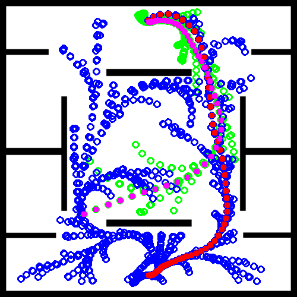

# BiRiskRRTValidation

### _*.py_ Files Explanation

* _riksrrt.py_
  * Implement unidirectional RiskRRT. 

* _biriksrrt.py_
  * Implement bidirectional RiskRRT (BiRiskRRT) and endow RiskRRT and BiRiskRRT with dynamic planning capability.

* _param.py_
  * setup hyper-parameters for the planners.

* _utils.py_
  * define the data structures and classes used in the planners.

* _main.py_
  * run the planners multiple times and record the statistic results into 'results' folder.

* _result_analysis.py_
  * compute and print the mean values and standard values of the trails conducted by _main.py_.
***************************
### Folders Introduction

* ___/data___
  * This folder stores the data of dynamic pedestrians from different datasets.

* ___/maps___
  * This folder contains the test maps (_.png_ format).

* ___results___
  * This folder stores the test results and also the visualizations of the planning processes.
  * ___/dynamic___ is for tests with dynamic obstacles (pedestrians).
  * ___/static___ is for tests without dynamic obstacles.

************************************
### Current Results (Dynamic '_crowds_zara01_, _crowds_zara02_, _crowds_zara03_')
#### Map A, '_crowds_zara01_'
| Items | Means | Standard Error|
| ----  | ----      | ----  |
|Bidirectional time|  60.02 |  42.72|
|Bidirectional cost|  42.55 |  7.13|
|Bidirectional Navigation time|  30.68 |  5.43|
|Unidirectional time|  61.9 |  42.25|
|Unidirectional cost|  45.06|  7.05|
|Navigation time|  31.96|  5.05|
* Random Trees Visualization

  * 
  
  * 

* Navigation Demo

  * 
  
  * 
#### Map A, '_crowds_zara02_'
| Items | Means | Standard Error|
| ----  | ----      | ----  |
|Bidirectional time|  52.36 |  43.83|
|Bidirectional cost|  44.17 |  6.71 |
|Bidirectional Navigation time|  32.14 |  4.88|
|Unidirectional time|  88.5 |  291.65|
|Unidirectional cost|  45.52 |  6.63|
|Navigation time|  32.13 |  4.53|
* Random Trees Visualization

  * 
  
  * 
  
* Navigation 

  * 
  
  * 

#### Map A, '_crowds_zara03_'
| Items | Means | Standard Error|
| ----  | ----  | ----  |
|Bidirectional time|  51.74 |  35.97|
|Bidirectional cost|  42.71 |  6.46|
|Bidirectional Navigation time|  30.43 |  4.18|
|Unidirectional time|  58.41 |  50.78|
|Unidirectional cost|  44.15 |  6.0|
|Navigation time|  31.2 |  3.95|

* Random Trees Visualization

  * 
  
  * 

* Navigation Demo

  * 
  
  * 
#### MapB, ' _crowds_zara01_'
| Items | Means | Standard Error|
| ----  | ----  | ----  |
|Bidirectional time|  30.35 |  18.94 |
|Bidirectional cost|  35.19 |  5.48 |
|Bidirectional Navigation time|  26.13 |  5.34 |
|Unidirectional time|  36.29 |  28.96 |
|Unidirectional cost|  34.77 |  5.1 |
|Navigation time|  26.5 |  4.34 |

* Random Trees Visualization
  * 
  
  * 

* Navigation Demo

  * 
  
  * 

#### MapB, ' _crowds_zara02_'
| Items | Means | Standard Error|
| ----  | ----  | ----  |
|Bidirectional time|  27.59 |  35.2 |
|Bidirectional cost|  34.09 |  5.14 |
|Bidirectional Navigation time|  24.85 |  4.44 |
|Unidirectional time|  43.58 |  111.15 |
|Unidirectional cost|  34.31 |  4.57 |
|Navigation time|  26.05 |  3.92 |

* Random Trees Visualization

  * 
  
  * 
  
* Navigation Demo

  * 
  
  * 

#### MapB, ' _crowds_zara03_'
| Items | Means | Standard Error|
| ----  | ----  | ----  |
|Bidirectional time|  21.69 |  26.74 |
|Bidirectional cost|  33.51 |  4.08 |
|Bidirectional Navigation time|  25.44 |  3.97 |
|Unidirectional time|  25.8 |  25.39 |
|Unidirectional cost|  32.85 |  4.13 |
|Navigation time|  24.98 |  2.74 |

* Random Trees Visualization

  * 
  
  * 

* Navigation Demo

  * 
  
  * 
#### MapC, ' _crowds_zara01_'
| Items | Means | Standard Error|
| ----  | ----  | ----  |
|Bidirectional time|  29.5 |  28.92 |
|Bidirectional cost|  36.61 |  1.75 |
|Bidirectional Navigation time|  25.15 |  2.11 |
|Unidirectional time|  54.04 |  73.82 |
|Unidirectional cost|  36.1 |  1.95 |
|Navigation time|  23.86 |  1.88 |

* Random Trees Visualization

  * 
  
  * 
  
* Navigation Demo

  * 
  
  * 
  
#### MapC, ' _crowds_zara02_'
| Items | Means | Standard Error|
| ----  | ----  | ----  |
|Bidirectional time|  40.07 |  119.45 |
|Bidirectional cost|  36.38 |  1.86 |
|Bidirectional Navigation time|  25.02 |  2.52 |
|Unidirectional time|  53.68 |  65.25 |
|Unidirectional cost|  36.12 |  1.69 |
|Navigation time|  23.76 |  1.7 |

* Random Trees Visualization

  * 
  
  * 

* Navigation Demo

  * 
  
  * 
  
#### MapC, ' _crowds_zara03_'
| Items | Means | Standard Error|
| ----  | ----  | ----  |
|Bidirectional time|  28.78 |  23.55 |
|Bidirectional cost|  36.78 |  2.33 |
|Bidirectional Navigation time|  25.39 |  2.83 |
|Unidirectional time|  54.79 |  69.66 |
|Unidirectional cost|  36.29 |  2.05 |
|Navigation time|  24.42 |  2.47 |

* Random Trees Visualization

  * 
  
  * 

* Navigation Demo

  * 
  
  * 
### Current Results (Static)
#### MapA
| Items | Means | Standard Error|
| ----  | ----  | ----  |
|Bidirectional time|  19.67 |  15.18 |
|Bidirectional cost|  43.89 |  6.62 |
|Bidirectional navigation time|  30.6 |  4.28 |
|Unidirectional time|  42.44 |  72.96 |
|Unidirectional cost|  44.53 |  6.74 |
|Navigation time|  31.05 |  3.96 |
|LQR-based time|  6.34 ||
|LQR-based cost|  45.43 |   |
|LQR-based navigation time|  38.62 |  |

* Navigation Demo

  * 
  
  * 
  
  LQR-based Bi-RRT:
  * 
 
  * 
  
  
#### MapB
| Items | Means | Standard Error|
| ----  | ----  | ----  |
|Bidirectional time|  8.52 |  8.44 |
|Bidirectional cost|  32.19 |  3.47 |
|Bidirectional Navigation time|  24.18 |  3.51 |
|Unidirectional time|  13.23 |  13.73 |
|Unidirectional cost|  32.94 |  4.28 |
|Navigation time|  24.62 |  2.83 |
|LQR-based time|  2.89 | |
|LQR-based cost|  36.39 |   |
|LQR-based navigation time|  32.58 |  |

* Navigation Demo

  * 
  
  * 
  
  LQR-based Bi-RRT:
  * 
  * 
  
#### MapC
| Items | Means | Standard Error|
| ----  | ----  | ----  |
|Bidirectional time|  17.33 |  25.31 |
|Bidirectional cost|  36.18 |  1.59 |
|Bidirectional Navigation time|  24.83 |  2.0 |
|Unidirectional time|  31.27 |  34.08 |
|Unidirectional cost|  36.75 |  1.88 |
|Navigation time|  24.36 |  1.99 |
|LQR-based time|  5.93 |   |
|LQR-based cost| 45.19 |   |
|LQR-based navigation time|  35.62 |  |

* Navigation Demo

  * 
  
  * 
  
  LQR-based Bi-RRT:
  * 
  * 
  
### Current Results (Only Dynamic Obstacles)

#### ' _crowds_zara01_'
| Items | Means | Standard Error|
| ----  | ----  | ----  |
|Bidirectional time|  3.52 |  3.13 |
|Bidirectional cost|  24.53 |  2.13 |
|Bidirectional Navigation time|  18.52 |  1.5 |
|Unidirectional time|  5.28 |  4.05 |
|Unidirectional cost|  25.15 |  1.91 |
|Navigation time|  18.09 |  1.23 |

* Random Trees Visualization

  * 
  
  * 

* Navigation Demo

  * 
  
  * 
  
#### ' _crowds_zara02_'
| Items | Means | Standard Error|
| ----  | ----  | ----  |
|Bidirectional time|  1.42 |  0.99 |
|Bidirectional cost|  23.64 |  0.81 |
|Bidirectional Navigation time|  18.02 |  0.95 |
|Unidirectional time|  3.82 |  3.74 |
|Unidirectional cost|  24.61 |  1.26 |
|Navigation time|  17.89 |  0.98 |

* Random Trees Visualization

  * 
  
  * 

* Navigation Demo

  * 
  
  * 

#### ' _crowds_zara03_'
| Items | Means | Standard Error|
| ----  | ----  | ----  |
|Bidirectional time|  3.61 |  1.62 |
|Bidirectional cost|  25.6 |  2.43 |
|Bidirectional Navigation time|  19.08 |  1.29 |
|Unidirectional time|  5.79 |  5.66 |
|Unidirectional cost|  25.27 |  1.54 |
|Navigation time|  18.22 |  0.97 |

* Random Trees Visualization

  * 
  
  * 

* Navigation Demo

  * 
  
  * 

